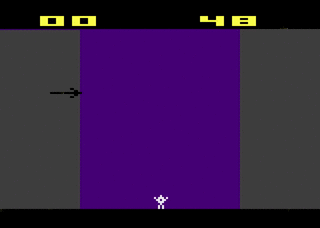

# FireWorks - An Atari 2600 Game (Portfolio)

    

## Introduction
This project was completed as part of a 15-credit Portfolio project at Metropolia University of Applied Sciences. My goal was to combine learning assembly language with game development. I chose the Atari 2600 console as my platform because it requires assembly coding due to its hardware limitations. Additionally, there is a wealth of online documentation and tutorials available for the Atari 2600.

## Objective
While my degree included extensive C++ training, I wanted to deepen my understanding of low-level programming concepts by learning assembly language. The aim of this project was to immerse myself in an environment that required assembly coding, making the Atari 2600 a suitable choice due to its unique constraints.

## Game Description
The game revolves around a teenager who frequently plays with fireworks, much to the annoyance of a neighbor who owns a bow and arrows. The neighbor attempts to shoot down the fireworks while the teenager is trying to ignite them. The goal is to see how many fireworks the teenager can successfully set off while avoiding the neighbor's arrows.

## Development Process
I prepared for this project by studying six chapters from "Digital Design and Computer Architecture" by Sarah Harris and completing the online course "Learn Assembly Language by Making Games for the Atari 2600."

Using a template from the "Learn Assembly Language by Making Games for the Atari 2600" course as a foundation, I added new features, logic, and graphics to create a unique game experience.

## Game Mechanics
Player 0 (Teenager) can move left and right, as well as shoot using the space button. A successful shot that causes a fireworks explosion will grant 1 point to Player 0. However, if Player 0 is positioned directly below the firework when it explodes, their score will be reset to 0.

    

Player 1 can intercept the firework as it ascends. If Player 1 successfully intercepts the firework, 2 points will be deducted from Player 0's score.

## Lesson Learned
Through my experience working on an 8-bit Atari 2600 assembly project, I discovered how to navigate the system's resource constraints while optimizing my code for both performance and memory usage. It taught me to prioritize features and make thoughtful trade-offs, all while achieving engaging gameplay within the limited confines of the hardware. This project pushed me to manipulate sprites, colors, and sounds using minimal data and code, which was key in creating visually appealing and captivating experiences.

The tight schedule and precise synchronization of the Atari 2600's operation demanded careful control over code execution in harmony with the video and audio output. This deepened my appreciation for the importance of frame-by-frame control and the need to use the TV monitor's raster beam synchronization effectively to maintain stable visuals and audio. Debugging assembly code without modern tools was a challenge, yet it sharpened my skills in manual code stepping and memory analysis. This experience nurtured my ability to embrace creative problem-solving as I devised innovative ways to work within constraints and implement unique game mechanics and features. Overall, the project was both a rewarding and enlightening journey, offering me valuable insights into low-level programming and game development.

## Running the Game
Download the cart.bin file from itch.io or from this github repository, and run it on an emulator such as the Stella emulator.

