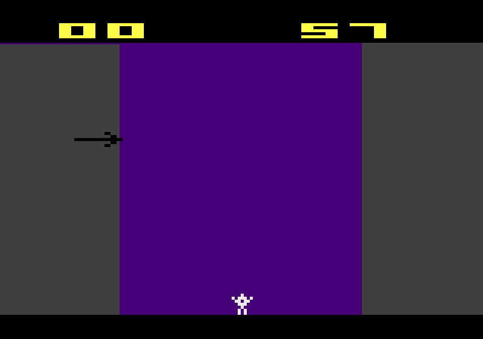

# FireWorks - Atari 2600 Game

    

## Introduction
This project was made for the 15 credit Portfolio project held at Metropolia University of Applied Sciences. My goal was to combine learning Assembly and create a game. I chose the Atari 2600 console as a platform, since it requires assembly coding due to its limitations, and it has well established online documentations, and tutorials.

## Objective
We had extensive C++ training in our degree, and to deepen our understanding of more low level concepts, I decided to learn assembly. The goal of this project was to put myself in an environment that requires assembly, which making a game for Atari 2600 is the perfect platform to do that due to its limitations.

